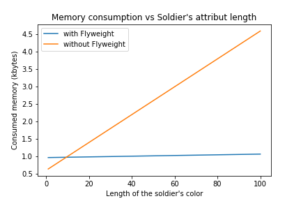
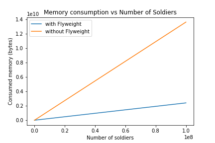
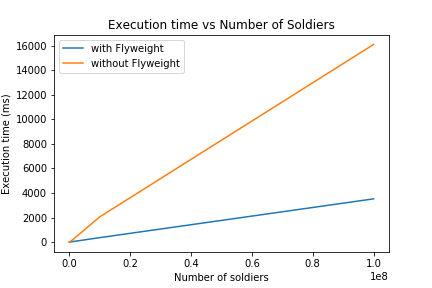

#### About

Comparasion of a problem to create soldiers, with and without using Flyweight design pattern ( see slides for more details)

### How to run?

```sh
  $ make NUM_SOLDIERS=4 
```
##### See Makefile for details

### Response Time and Memory Usage Comparasion
 
 
 


### Contributors

 MÉRY Andy
 QUINTANA Gonzalo
 SANTOS Daniel
